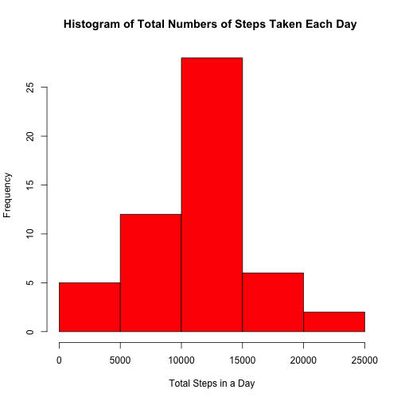
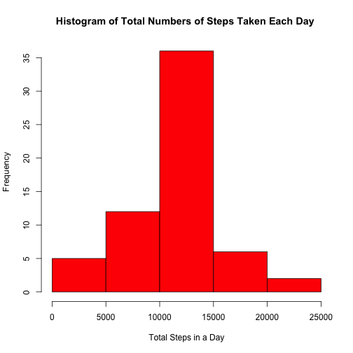
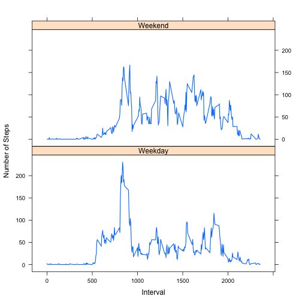

# Reproducible Research: Peer Assessment 1

This document describes the processing and analysis of data from a personal activity monitoring device.

The original data can be downloaded [here](https://github.com/coopersnail/RepData_PeerAssessment1). 

## Loading and preprocessing the data
1. Set your working directory (INSERT YOUR WORKING DIRECTORY) to the folder containing **activity.csv**.
2. Use read.csv() to load the file
3. Check the data
4. Convert the **date** variable into Date class

```r
setwd("~/Documents/data_science_coursera/rr")
# setwd('~/data_science_coursera/rr')
act <- read.csv("activity.csv", header = T, stringsAsFactor = F)
head(act)
```

```
##   steps       date interval
## 1    NA 2012-10-01        0
## 2    NA 2012-10-01        5
## 3    NA 2012-10-01       10
## 4    NA 2012-10-01       15
## 5    NA 2012-10-01       20
## 6    NA 2012-10-01       25
```

```r
str(act)
```

```
## 'data.frame':	17568 obs. of  3 variables:
##  $ steps   : int  NA NA NA NA NA NA NA NA NA NA ...
##  $ date    : chr  "2012-10-01" "2012-10-01" "2012-10-01" "2012-10-01" ...
##  $ interval: int  0 5 10 15 20 25 30 35 40 45 ...
```

```r
act$date <- as.Date(act$date)
```

  
## What is mean total number of steps taken per day?

First, the sum of total steps by date has to be calculated. There are many ways to do so. 

One way to do so is to use **tapply()**. Note that NAs are removed. To avoid printing out long tables, results are hidden for this part.

```r
temp1 <- data.frame(tapply(act$steps, act$date, sum, na.rm = T))
names(temp1) <- "total_steps"
temp1
```


Try it without setting na.rm = T.

```r
temp2 <- data.frame(tapply(act$steps, act$date, sum))
names(temp2) <- "total_steps"
temp2
```


Did you noticed that the dates with NA for total_steps in temp2 are the same as those with values of zero in temp1? This implies that for these dates, all of the entries are NAs. The following code can verify this implication.  

```r
act2 <- act[is.na(act$steps), ]
unique(act2$date)
```

```
## [1] "2012-10-01" "2012-10-08" "2012-11-01" "2012-11-04" "2012-11-09"
## [6] "2012-11-10" "2012-11-14" "2012-11-30"
```

```r

rownames(temp2[is.na(temp2$total_steps), ])
```

```
## [1] "2012-10-01" "2012-10-08" "2012-11-01" "2012-11-04" "2012-11-09"
## [6] "2012-11-10" "2012-11-14" "2012-11-30"
```

  
  
Going back to taking the sum of the number of steps by date, my preferred way is to use the **data.table** package. Here na.rm = T is not used to avoid zeros being introduced as we have seen before. 

```r
library(data.table)
dt_act <- data.table(act, key = "date")
total_step_per_day <- dt_act[, sum(steps), by = date]
```


  
Note that 'total_step_per_day' is a data table and **total_step_per_day$V1** is the number of steps each day. We can rename it by using **setnames()**. 


```r
str(total_step_per_day)
```

```
## Classes 'data.table' and 'data.frame':	61 obs. of  2 variables:
##  $ date: Date, format: "2012-10-01" "2012-10-02" ...
##  $ V1  : int  NA 126 11352 12116 13294 15420 11015 NA 12811 9900 ...
##  - attr(*, "sorted")= chr "date"
##  - attr(*, ".internal.selfref")=<externalptr>
```

```r
setnames(total_step_per_day, "V1", "total_steps")
```

  
  
A histogram of the total numbers of steps taken each day can be generated using **hist()**.   

```r
hist(total_step_per_day$total_steps, main = "Histogram of Total Numbers of Steps Taken Each Day ", 
    xlab = "Total Steps in a Day", col = "red")
```

 

  
Take the mean and median of total numbers of steps taken each day using mean() and median().  

For this part of the assignment, the missing values are ignored by using **na.rm = TRUE** in calculations.   


```r
mean1 <- mean(total_step_per_day$total_steps, na.rm = T)
mean1
```

```
## [1] 10766
```

```r

median1 <- median(total_step_per_day$total_steps, na.rm = T)
median1
```

```
## [1] 10765
```


## What is the average daily activity pattern?

There 288 5-minute intervals for each day, ranging from 0 to 2355 in steps of 5. Sum the number of steps for a given interval across all days, e.g. interval 2330 for all days, and divide that sum by the number of days, one will get the average number of steps taken for that interval, averaged across all days. That is easily done with a data.table query. 

```r
average_steps_per_interval <- dt_act[ , mean(steps, na.rm = T), by = interval] 

# You can also do the following but there is one extra step
# total_steps_per_interval <- dt_act[ , sum(steps, na.rm = T), by = interval]
# total_steps_per_interval$V1 <- total_steps_per_interval$V1/53

setnames(average_steps_per_interval,"V1","average_steps")

with(average_steps_per_interval,
     plot(interval, average_steps,                  # data
              type = "l",                           # line graph
              lwd = 1.5))                           # set line width
```

 


The 5-minute interval, on average across all the days in the dataset, containing the maximum number of steps can be obtained by simply subsetting. 

```r
average_steps_per_interval$interval[average_steps_per_interval$average_steps == 
    max(average_steps_per_interval$average_steps)]
```

```
## [1] 835
```

  
## Imputing missing values
The total number of rows with NAs can be obtained by using either of the following.

```r
lapply(act, function(x) {
    sum(is.na(x))
})
```

```
## $steps
## [1] 2304
## 
## $date
## [1] 0
## 
## $interval
## [1] 0
```

```r

sum(!complete.cases(act$steps, act$date, act$interval))
```

```
## [1] 2304
```


NAs are replaced by the mean for those given 5-minute intervals. There are 61 dates in the data set. We can repeat the vector containing the mean number of steps for each interval acrossed all days 61 times to match the length of the original data set.   


```r
length(unique(act$date))
```

```
## [1] 61
```

```r
fill <- rep(average_steps_per_interval$average_steps, 61)
```

  
Then create a copy of the orginal data set and use logical statements to fill in the NAs. 

```r
act_new <- act
act_new$steps[is.na(act_new$steps)] <- fill[is.na(act_new$steps)]
```


Now we repeat the procedures to create the histogram for total steps in a day and the respective mean and median.


```r
dt_act_new <- data.table(act_new, key = "date")
total_step_new <- dt_act_new[, sum(steps), by = date]
setnames(total_step_new, "V1", "total_steps")

# Make histogram
hist(total_step_new$total_steps, main = "Histogram of Total Numbers of Steps Taken Each Day ", 
    xlab = "Total Steps in a Day", col = "red")
```

 

```r

# Although there should not be any NAs now, the exact same syntax is used
# here to demonstrate that the only difference between the current
# statisitics and the previous statistics is resulted from imputing the NAs.
mean2 <- mean(total_step_new$total_steps, na.rm = T)
mean2
```

```
## [1] 10766
```

```r

median2 <- median(total_step_new$total_steps, na.rm = T)
median2
```

```
## [1] 10766
```


You probably noticed that the mean does not change. That is actually not surprising because the NAs reside exclusively and exhaustively in 8 dates. Therefore, every entry on those days are average number of steps taken for all possilbe 5-minute intervals. For such a given date, the sum of those averages, the total number of steps for the day, is the same as the mean of total number of steps taken in a day. 

However the median is shifted from 10765 to 1.0766 &times; 10<sup>4</sup> because now there are more dates in the calculation. 

## Are there differences in activity patterns between weekdays and weekends?
  
First, we create a new factor variable in the dataset with two levels – “weekday” and “weekend” indicating whether a given date is a weekday or weekend day, by using ifelse().


```r
act_new$wd <- ifelse(weekdays(act_new$date) == "Saturday" | weekdays(act_new$date) == 
    "Sunday", "Weekend", "Weekday")
```


Then we can use the data.table() technique seen above to calculate the averages across weekdays and weekends. 


```r
dt_act_new <- data.table(act_new)
average_steps_wd <- dt_act_new[, mean(steps, na.rm = T), by = "wd,interval"]
setnames(average_steps_wd, "V1", "average_steps")
average_steps_wd
```

```
##           wd interval average_steps
##   1: Weekday        0       2.25115
##   2: Weekday        5       0.44528
##   3: Weekday       10       0.17317
##   4: Weekday       15       0.19790
##   5: Weekday       20       0.09895
##  ---                               
## 572: Weekend     2335      11.58726
## 573: Weekend     2340       6.28774
## 574: Weekend     2345       1.70519
## 575: Weekend     2350       0.02830
## 576: Weekend     2355       0.13443
```


Last, we can use the lattice package to draw a panel line plot containing with the 5-minute interval as x-axis and the average number of steps taken, averaged across all weekday days or weekend days as y-axis.

```r
library(lattice)
xyplot(average_steps_wd$average_steps ~ average_steps_wd$interval | average_steps_wd$wd, 
    type = "l", lwd = 1.5, xlab = "Interval", ylab = "Number of Steps", layout = c(1, 
        2))
```

 

